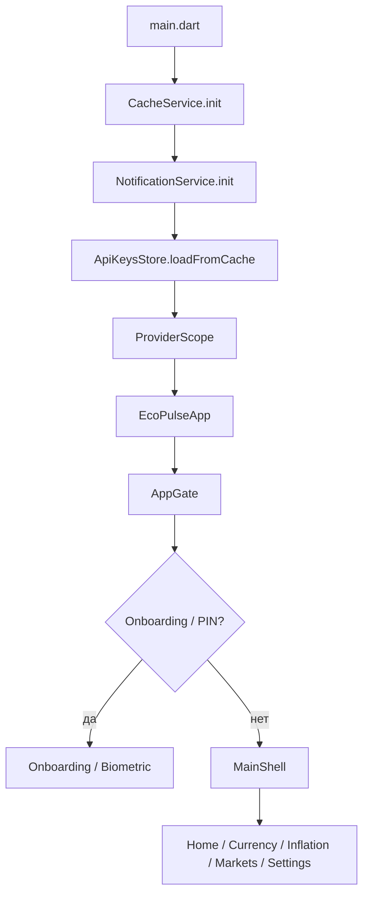

# Архитектура EcoPulse

> Автор: Цымбал Е. В. · апрель–июнь 2026

## Обзор

Приложение построено по **feature-first** структуре с разделением на слои.  
Подробная карта папок: **[project-structure.md](project-structure.md)**.

```
┌─────────────────────────────────────────────────────────┐
│  features/          UI: экраны, карточки, sheet'ы        │
├─────────────────────────────────────────────────────────┤
│  providers/         Riverpod по доменам (app/, markets/, …) │
├─────────────────────────────────────────────────────────┤
│  data/              repositories → API + Hive cache      │
├─────────────────────────────────────────────────────────┤
│  core/              theme, motion, utils, services      │
└─────────────────────────────────────────────────────────┘
```

## Поток запуска



## Навигация

| Компонент | Файл | Роль |
|-----------|------|------|
| `MainShell` | `features/shell/main_shell.dart` | 5 табов через `navigationIndexProvider` |
| `AppTabLayer` | `shared/widgets/motion_widgets.dart` | Анимация смены таба |
| `AppShellShortcuts` | `features/shell/app_shell_shortcuts.dart` | Клавиши 1–5 (web) |
| `AppPageRoute` | `core/motion/app_motion.dart` | Единый переход между экранами |
| `openBondAnalyticsPage` | `core/motion/app_motion.dart` | Hero-переход в аналитику облигаций |

Внутри табов — обычный `Navigator.push` / `openAppPage` для детальных экранов.

## State management (Riverpod)

Центральный файл: **`lib/providers/app_providers.dart`**

| Provider | Данные |
|----------|--------|
| `currencyRatesProvider` | Курсы Frankfurter + MOEX |
| `inflationProvider` | CPI World Bank |
| `cryptoFeedProvider` | CoinGecko |
| `stockMarketProvider` | MOEX + Finnhub |
| `keyRateProvider` | Ключевая ставка ЦБ |
| `navigationIndexProvider` | Активный таб shell |
| `demoModeProvider` | Переключение mock/live |

Паттерн загрузки:

1. `AsyncNotifier.build()` — первая загрузка
2. `refresh(force: true)` — pull-to-refresh с `copyWithPrevious` (нет мигания UI)
3. При `demoModeProvider == true` — данные из `DemoFixtures`

## Слой данных

```
API (Dio)  →  Repository  →  parse JSON  →  Model
                  ↓
            CacheService (Hive)
                  ↓
         offline: последний кэш + баннер
```

| Репозиторий | Источник |
|-------------|----------|
| `CurrencyRepository` | Frankfurter, MOEX ISS |
| `InflationRepository` | World Bank API |
| `MarketRepository` | CoinGecko, MOEX, Finnhub |
| `CbrRepository` | ЦБ РФ (ключевая ставка) |

## Кэш и offline

- **`CacheService`** — Hive, ключи по типу данных
- При ошибке сети репозиторий возвращает кэш
- UI показывает `LastUpdatedBanner` / offline hint

## Локализация

- ARB: `lib/l10n/app_ru.arb`, `app_en.arb`
- Генерация: `AppLocalizations` (не редактировать вручную)
- `localeProvider` — переключение RU/EN в настройках

## Фоновые задачи

- **`NotificationService`** — push, утренняя сводка, напоминания купонов
- **`BackgroundAlertService`** + Workmanager — проверка price alerts (не на web)
- **`BondCouponReminderService`** — локальные уведомления по облигациям

## AI-ассистент

```
AssistantFab → AssistantSheet
    → IntentRouter (локальные команды)
    → LocalResponder (ответ без сети)
    → AssistantService + GeminiClient (опционально, если ключ)
```

Контекст рынка собирается в `AssistantContext` из текущих провайдеров.

## Тестирование

- `test/` — unit-тесты утилит (bond_analytics, portfolio_math, intent_router…)
- `test/widget_test.dart` — базовые widget/formatters тесты
- Запуск: `flutter test` (75 тестов на v1.0.44)

## Расширение проекта

1. **Новый экран** → `lib/features/<module>/`
2. **Новые данные** → model + repository + provider
3. **Новые строки** → `.arb` + `flutter gen-l10n`
4. **Шапка файла** → см. [code-conventions.md](code-conventions.md)
